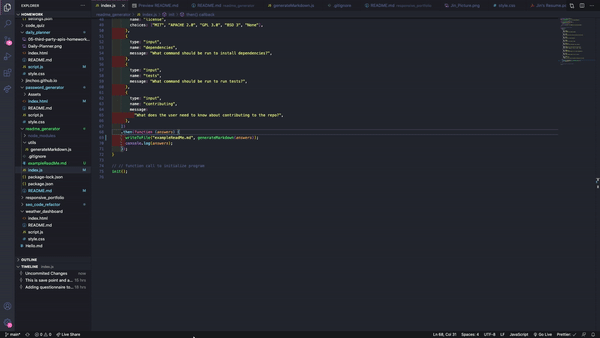

# README Generator

## Introduction
* As a student devloper, the project was to create README Generator.

## Table of Contents
1.  Description
2.  Techologies
3.  Setup

## Description:
1.  As a developer, it important to have quality README generator.  
2.  In this project, Node.js terminal generates a README.md file based on input about the project.  Look at exampleReadMe.md as an example.  
3.  To generate the README, 
    *  Copy npm i inquirer from https://www.npmjs.com/package/inquirer in order to install the following npm package dependencies as specified in the package.jason.  
    *  inquirer that will prompt you for your inputs from the terminal.  
    *  When you run node index.js, the appication uses the inquirer package to prompt you in the command line with a series of questions about the GitHub and the project. 
    *  fs.writeFile is used to generate your project's README.me file.  
4.  Technologies:
    *  JavaScript
    *  ES6
    *  VS-Code Editor
    *  GitHub Repostory
5.  Setup:
    *  Right click the file index.js to "Open in integrated terminal."
    *  Node terminal
    *  Right click the README.md to "Open Preview".

